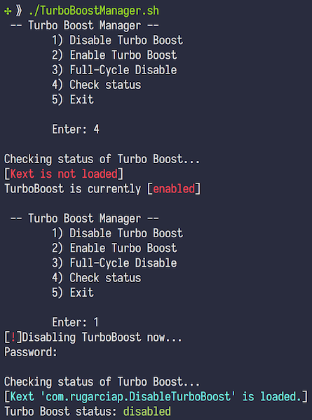

# Turbo Boost manager

## About this project

This tool is **a shell wrapper** for the functionality of [Turbo Boost Switcher (TBS)](https://github.com/rugarciap/Turbo-Boost-Switcher) in the command line. To be honest, you're probably better off using TBS GUI. 

This tool prioritizes security therefore, you do have to enter password everytime you run the script. If you do not want to enter the password, just buy Turbo Boost Switcher (TBS) PRO or use [edupr91's turbo-boost-disable](https://github.com/edupr91/turbo-boost-disable), but bear in mind that there are security implications of using his method.

**Note:** There is a branch named `tmux` for this project which allows TurboBoostManager to run in a tmux session. Although even with that it has to be "unloaded-and-loaded" again after a system sleep.

## Why this Fork?

+ I like menus, and color-coded information.
+ [@rugarciap](https://github.com/rugarciap) gave his blessings in [this issue](https://github.com/rugarciap/Turbo-Boost-Switcher/issues/115) to use `kexutil` to load his kexts.
+ I do not like having to load up the TBS GUI.
+ I personally do not use any of the PRO features TBS offers.
+ I didn't want to download TBS manually :)

# Install

This is a shell script that uses Apple's CLI kext management tools (`kextunload` and `kextutil`) to disable/enable Turbo Boost on 64-bit macOS, by loading/unloading the kext from [TBS](https://github.com/rugarciap/Turbo-Boost-Switcher).

When you run TurboBoostManager.sh, if you don't already have installed TBS separately, it will automatically:
- download the official Turbo_Boost_Switcher_v2.10.2.dmg binary package
- extract the kext files locally in 'tbswitcher_resources'
- remove temporary files

Since kexts must be root-owned, you need to sudo chown them once, after downloading.

> Consider buying TBS Pro to support the original developer  [@rugarciap](https://github.com/rugarciap).

# How to use

Run Turbo Boost Manager and enjoy your cooler mac.

  ```sh
  ./TurboBoostManager
  ```
  The CLI presents you the following options. Pick one to do what you want.

  ```sh
 -- Turbo Boost Manager --
	1) Disable Turbo Boost
	2) Enable Turbo Boost
	3) Re-Disable
	4) Check status
	5) Exit
  ```
  
  
  
  **N.B.** option #3, unloads the kext and loads it back again, to ensure that the kext is loaded. It is probably more useful after waking system from sleep when the kext is automatically unloaded.

## Licence
This software fundamentally relies on the TBS kernel extension (kext).
This repository is distributed under the GNU General Public Licence v2.0, of which the terms are:

```
Turbo Boost disabler / enable app for Mac OS X
Copyright (C) 2013  rugarciap

This program is free software; you can redistribute it and/or modify
it under the terms of the GNU General Public License as published by
the Free Software Foundation; either version 2 of the License, or
(at your option) any later version.

This program is distributed in the hope that it will be useful,
but WITHOUT ANY WARRANTY; without even the implied warranty of
MERCHANTABILITY or FITNESS FOR A PARTICULAR PURPOSE.  See the
GNU General Public License for more details.

You should have received a copy of the GNU General Public License along
with this program; if not, write to the Free Software Foundation, Inc.,
51 Franklin Street, Fifth Floor, Boston, MA 02110-1301 USA.
```

In accordance with the terms of the licence, I am distibuting this software under the same licence.
